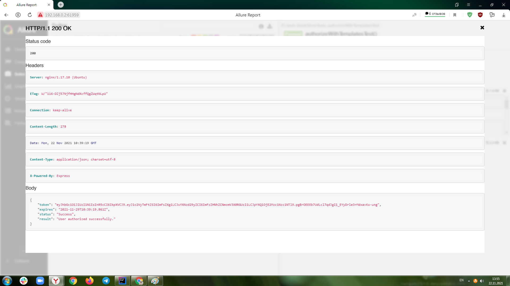

### Добавляем в Allure отчет "индивидуальности из шаблона":

1. Создаем папку filters с файлом CustomLogFilter
2. В директории resourses  создаем папку tpl и помещаем в нее 2 файла-шаблона request.ftl и response.ftl

